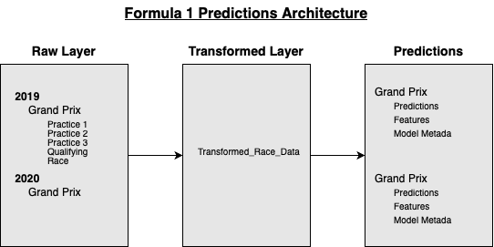

# Predict Formula 1 Races with AWS Lambda
Welcome to the Formula 1 Race Predictions repository! This project uses FastF1 API data to predict the outcome for Formula 1 races. 
It utilizes various Python packages like Pandas, Sklearn and machine learning algorithms like Gradient Boost to predict the outcomes and is hosted on a serverless enviromentment with AWS Lambda. 

## 💻 Tech Stack

<ul> 
  <li>Data Source: FastF1 API</li>
  <li>Compute: AWS Lambdas (with Docker) </li>
  <li>Storage: AWS S3 </li>
  <li>Algorithms: Linear Regression, Random Forrest, Gradient Boost </li>
  <li>Notifications: Telegram API / Bot </li>
  <li>Testing: Postman / Docker </li>
</ul>


## 📐 Architecture 


## 📈 Model Performance 
To evaluate the model, I'm mainly using R² (R-squared). R² quantifies how well your model explains the variability of the dependent variable. A higher R² value (closer to 1) indicates that a larger proportion of variance is explained by the model, suggesting a better fit to the data. 

I chose R² because it is relatively easy to interpret, is able to compare different models against each other, and is context independent, meaning it does not rely on the scale of the dependent variable, making it a versatile metric for various regression problems.


## ⏩️ Process Flow 
1. **Data Ingestion:** The ```f1_race_data_ingest_to_raw``` Lambda function fetches the configuration from AWS AppConfig to retrieve the season it should ingests into S3. It also checks if the data already exists in S3 to avoid unecessary processing. After each run it notifies the user via Telegram API about the number of processed rows. 
2. **Data Transformation:** The ```f1_transform_race_data``` Lambda function transforms the raw data by converting lap times, enriches the data with new features like driver standings, and stores the result in S3 in the transformed layer. After each run it notifies the user via Telegram API about the number of processed rows. 
3. **Model Training:** The ```f1_predict_races``` Lambda function is deployed as a Docker container to accomodate the additional libraries like sklearn. The function trains three different algorithms on the data to determine the best model accordig to R2. It also automatically selects the most relevant features with the ```SelectKBest``` method. In the end it returns the prediction of the race as well as model metadata, the most important features and the R2 of the best model versus the base model with only the qualifying time as variable.

## 🔧 Usage 
### Data Ingestion & Transformation 
To invoke the ```f1_race_data_ingest_to_raw``` and ```f1_transform_race_data``` Lambda function, you have to call the invoke url of the lambda function or for local use, call a python function withe following content: 
```
import sys
sys.path.append("..")
from f1_transform_race_data.lambda_function import lambda_handler

test_event = {
    "bucket_name": "<your-bucket-name>",
    "layer": <your-S3-directory>",
}

response = lambda_handler(test_event, None)
print(response)

```

### Model Prediction
1. Build docker container ```docker build -t f1-prediction .```
2. To run it on AWS : Push the local docker image to AWS Elastic Container Registry (ECR) so AWS Lambda can access the image.
3. To tun it locally: ```docker run -p 9000:8080 f1-prediction ``` (Add AWS environment variables)
4. Call local Docker endpoint or Lambda invoke url via Postman


## License
This project is licensed under the MIT License.
